# Full-Stack Supermarket Application

A modern, high-performance, full-stack e-commerce application designed to deliver a seamless shopping experience. Built with a focus on scalable architecture, clean UI/UX, and robust backend services, this project demonstrates end-to-end web development capabilities.

<div>
  <h3>📊 Application Home Page</h3>
  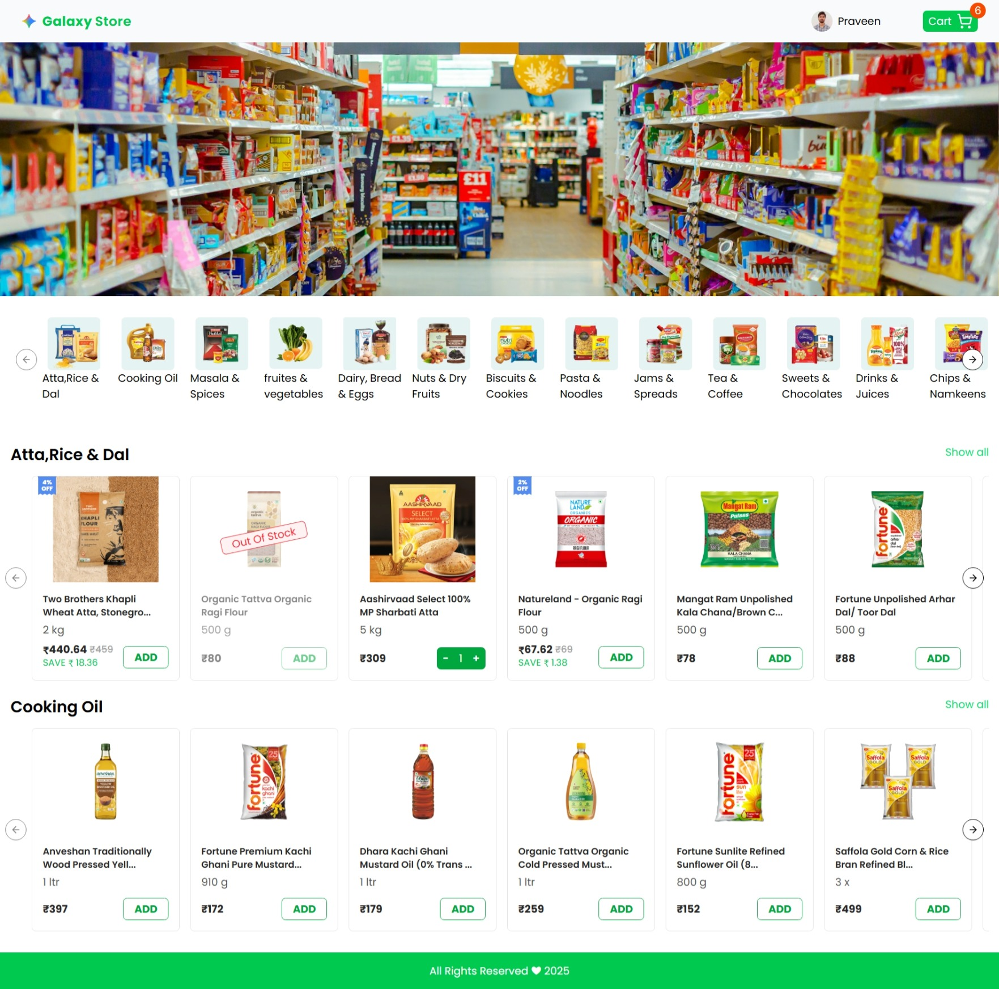

  <h3>🔍 Category Explorer</h3>
  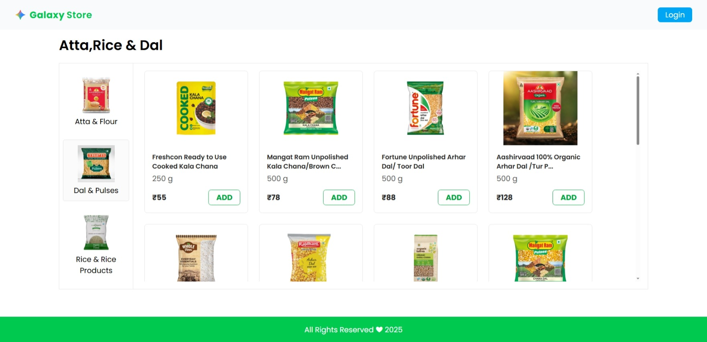

  <h3>🛒 Shopping Cart</h3>
  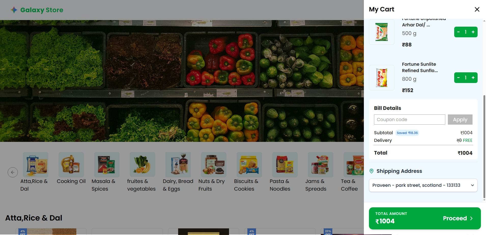

  <h3>📦 Orders Tracking</h3>
  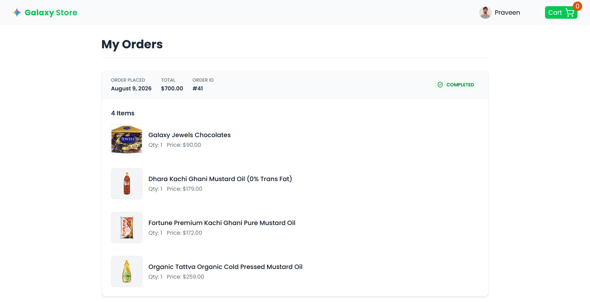
  
  <h3>💳 Razorpay Payment Gateway</h3>
  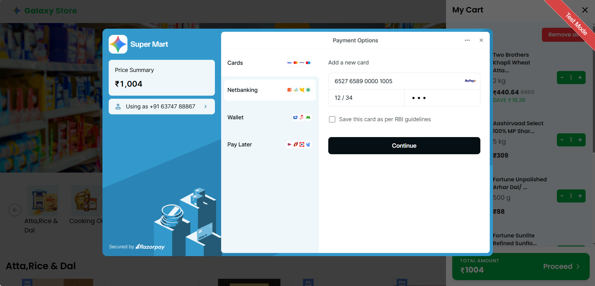

  <h3>🔐 Secure User Login</h3>
  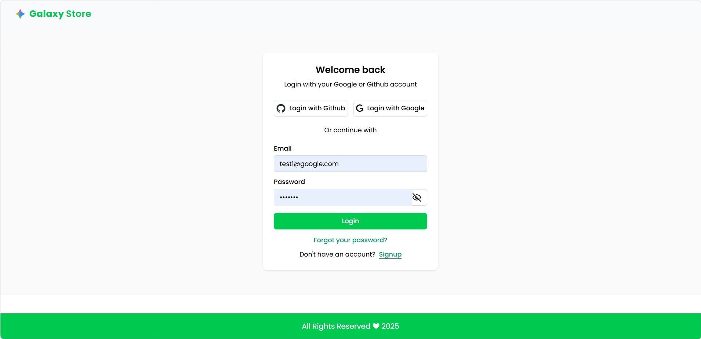

  <h3>📝 New User Registration</h3>
  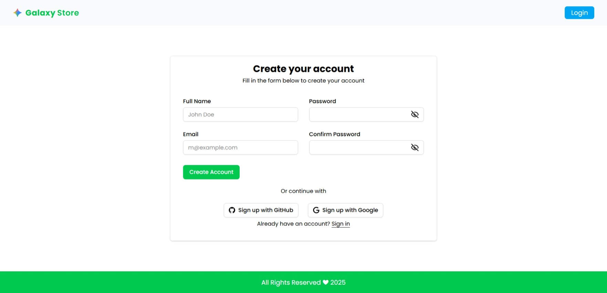

  <h3>📈 Analytics Dashboard: Revenue & Orders</h3>
  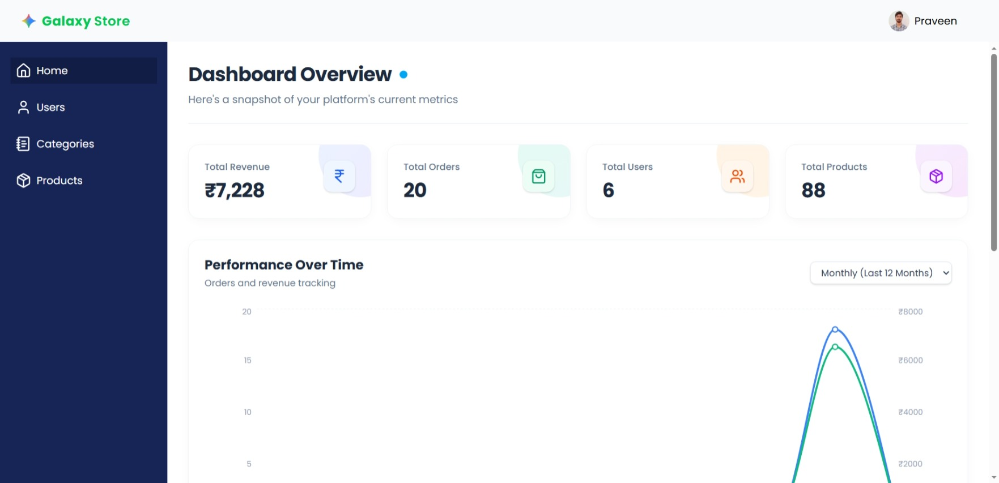

  <h3>📖 Analytics Dashboard: Top Customers</h3>
  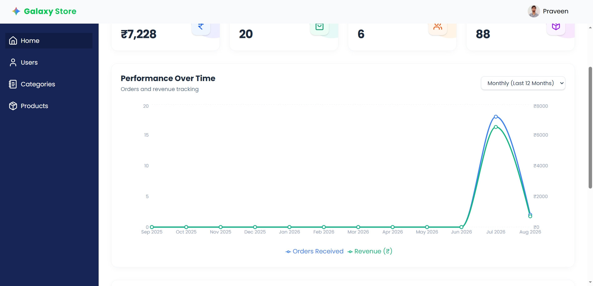

  <h3>⚙️ Dashboard: Settings & Configuration</h3>
  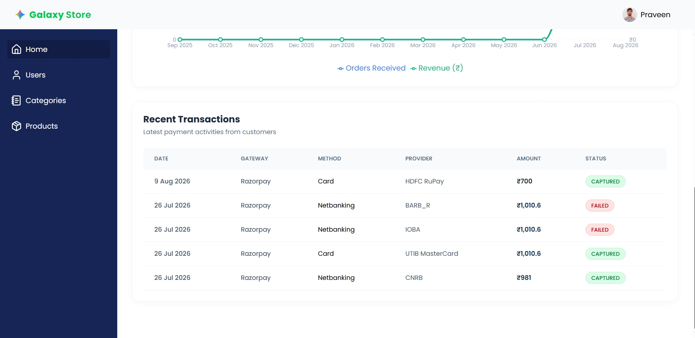

  <h3>🏷️ Product Categories & Sub-categories</h3>
  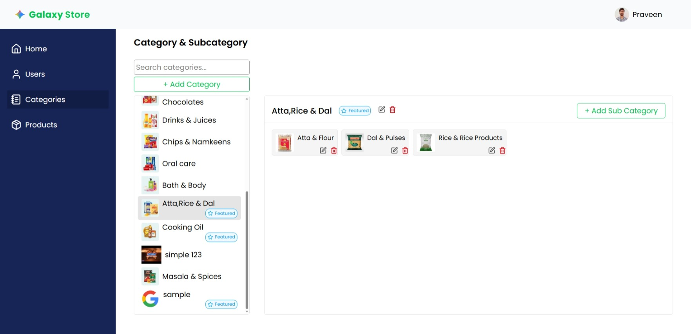

  <h3>📦 Dynamic Product Catalog</h3>
  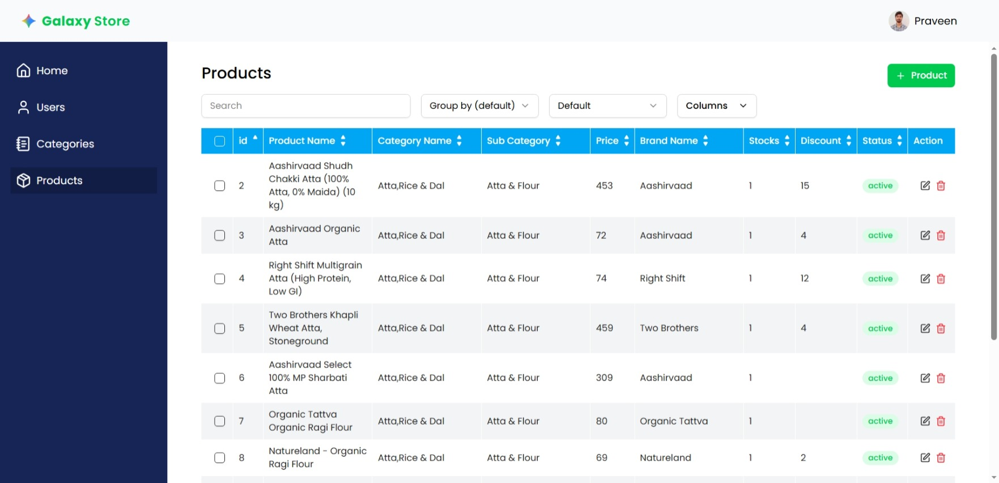

  <h3>🔨 Administrative Inventory Management</h3>
  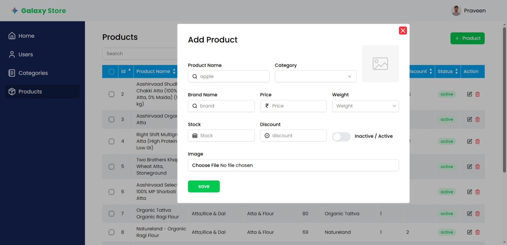

  <h3>⚙ User Settings & Preferences</h3>
  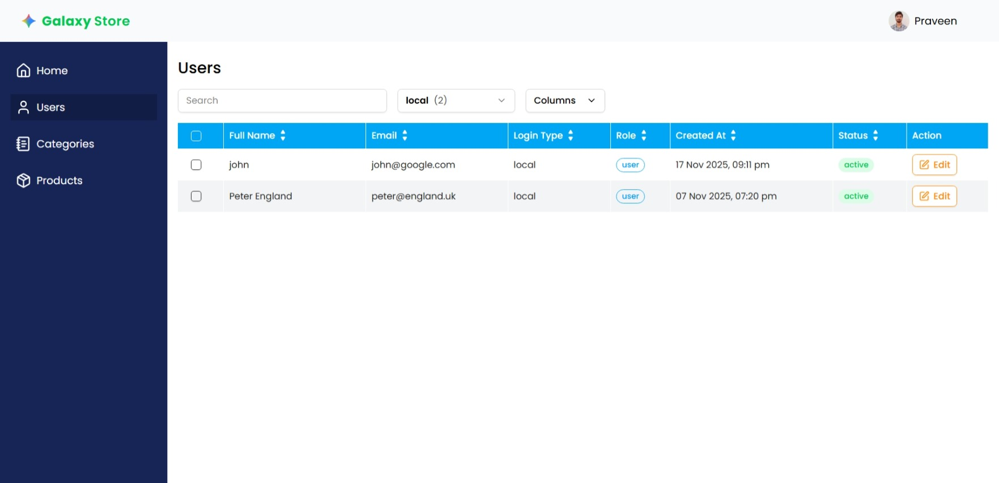
</div>

---

## 🎯 Executive Summary

This application was developed to showcase the integration of a modern React frontend with a high-performance Python backend. It handles real-world e-commerce complexities, including secure user authentication, dynamic product catalog management, and responsive stateful interfaces.

**For Recruiters & Hiring Managers:**

-   **Full-Stack Proficiency:** Demonstrates the ability to build and connect independent frontend and backend systems.
-   **Modern Tooling:** Uses industry-standard, top-tier technologies like React 19, FastAPI, TypeScript, and Tailwind CSS.
-   **Focus on UX/UI:** Leverages Shadcn/Radix primitives to ensure accessibility and aesthetic appeal.
-   **Problem Solving & State Management:** Successfully manages complex client-server state using TanStack React Query.

---

## ✨ Key Features & Business Logic

-   **Secure Authentication & Account Recovery:** Robust user registration and login workflows fully integrated with Supabase and secure HTTP-only cookies/JWTs. Features a complete real-email password reset flow.
-   **Admin Analytics Dashboard:** A comprehensive dashboard providing actionable insights through revenue tracking, monthly order trends, recent transactions, and top customers analytics widgets powered by Recharts.
-   **Comprehensive User Profile:** Detailed user settings page allowing responsive profile image uploads to Supabase, dynamic password management, and robust multi-address capabilities.
-   **Dynamic Product Catalog:** Users can browse products, apply filters, and search items. Data is fetched asynchronously with pagination handling logic entirely managed by FastAPI.
-   **Shopping Cart & Checkout Flow:** Add, update, and remove items with real-time UI updates. Includes a seamless checkout experience with mandatory address selection.
-   **Order Tracking & Payment Integration:** End-to-end payment processing with Razorpay with precise backend decimal conversions, and a dedicated frontend "Orders" page to track purchases.
-   **Production-Ready Security:** Hardened environment-aware secure cookie management, admin-only API route protection, elimination of debugging artifacts, and professional deployment standards.
-   **Responsive Layout:** Fully optimized for desktops, tablets, and mobile devices.

---

## 💻 Tech Stack & Architecture

### Frontend (Client-Side)

The frontend is built for speed, type safety, and maintainability.

-   **Core:** React 19, TypeScript, Vite
-   **Styling & Components:** Tailwind CSS v4, Shadcn UI (Radix Primitives)
-   **State Management & Data Fetching:** TanStack React Query v5
-   **Routing:** React Router v7
-   **Forms & Validation:** React Hook Form + Zod
-   **Data Visualization:** Recharts for analytics widgets

### Backend (Server-Side/API)

The backend leverages Python's modern async capabilities to serve blazing-fast RESTful APIs.

-   **Core framework:** FastAPI (Python)
-   **Database & BaaS:** Supabase (PostgreSQL implementation)
-   **Security:** JWT token-based authentication, CORS middleware configuration, and secure environment-aware cookies
-   **Integrations:** Razorpay API for scalable payment processing, Real Email Service for password resets

---

## 🚀 Getting Started (For Developers)

Want to run the project locally? Follow these steps:

### Prerequisites

-   Node.js (v18+)
-   Python (v3.9+)
-   A Supabase Account

### 1. Backend Setup

```bash
git clone <repository-url>
cd backend
```

-   Set up a virtual environment and load required packages.
-   Create a `.env` file in the `backend/` directory referencing your Supabase API keys and local CORS rules.
-   Start the server:
    ```bash
    fastapi dev main.py
    ```

### 2. Frontend Setup

```bash
cd frontend
npm install
```

-   Mirror environment requirements in `frontend/.env`.
-   Boot up the Vite dev server:
    ```bash
    npm run dev
    ```
